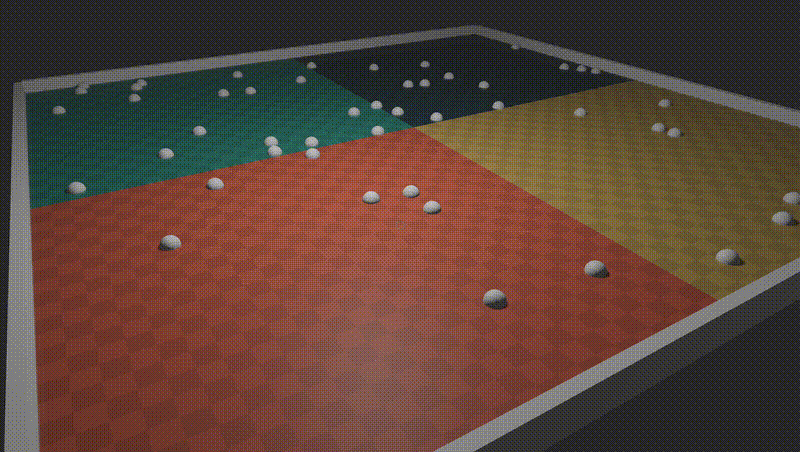
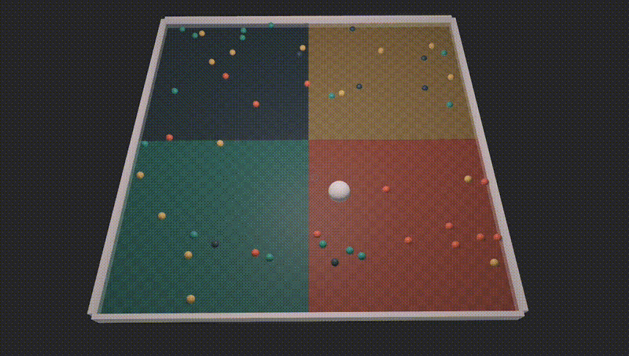
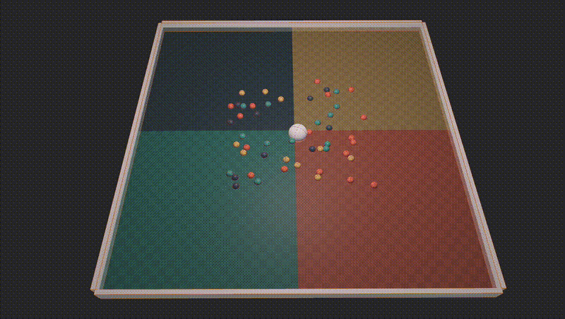

# Reinforcement Learning in Bevy Rust
This repository is a project to explore rust and reinforcement learning at the same time

# Setup
##### **todo: recall where I got libtorch and add that to setup instructions** and generally setup project to run (will figure this out when I setup on desktop)

# Running


### Environment Variables

Set the following environment variables in terminal from the projects root directory before running
```bash
export LIBTORCH_BYPASS_VERSION_CHECK=1
export LIBTORCH="$(pwd)/libtorch"
export DYLD_LIBRARY_PATH="$(pwd)/libtorch/lib" # mac
export LD_LIBRARY_PATH="$(pwd)/libtorch/lib" # windows/linux
```
### Startup Command

```
cargo run --bin main
```

#### **Flags:**
to use flags run the startup command `cargo run --bin main -- --<flag-1> --<flag-2>`
- `--headless` : runs game with no window if passed
- `--ai-control` : specify weather a human or ai is playing

### AI Model
to build the ai model architecture, run `python model_arc.py` from the directory `src/modeling`

## Devlog
### Plan
Create ball sorting game/simulation, and train pytorch model in the environment

I would like to define the model architecture in python using pytorch then load into rust to train using RL. See [here](https://github.com/LaurentMazare/tch-rs/tree/main/examples/jit-train).

### ---
Here is getting the basic bevy scene set up with a court full of balls bouncing around

### ---

I've got the core functionality of the game set up here with a player ball meant to sort the colored balls into their respective quadrants

### ---

Now we have the (untrained) AI model controling the player ball over several episodes


